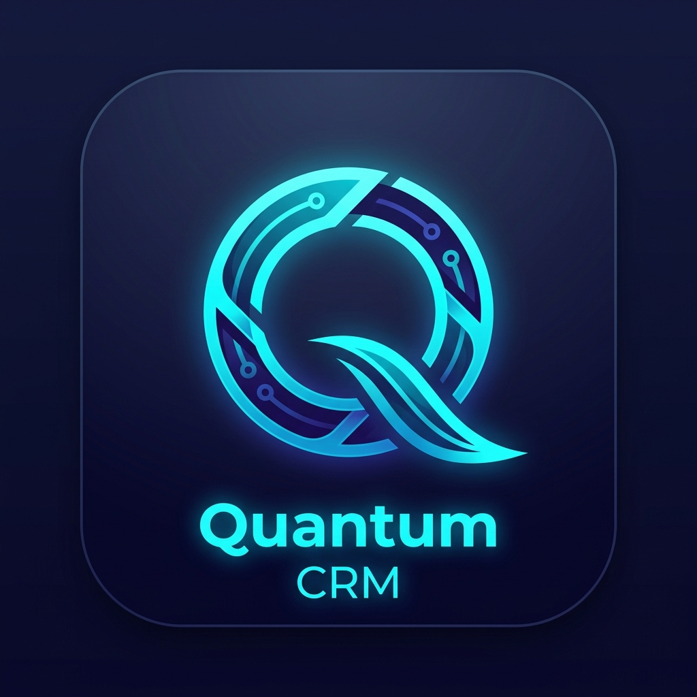
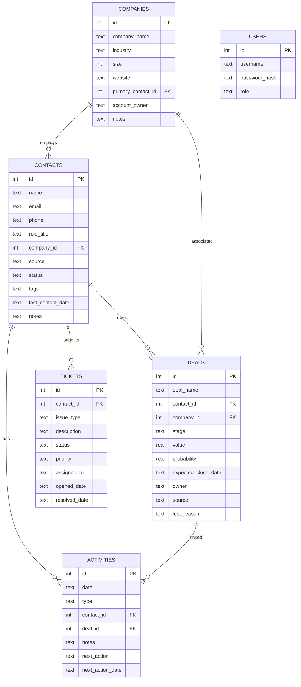

<p align="center">
  
</p>

<h1 align="center">Apex CRM</h1>
<p align="center">
  <strong>Self-Hosted Command Center for Customer Relationships</strong>
</p>

<p align="center">
  <a href="https://react.dev/"></a>
  <a href="https://nodejs.org/"></a>
  <a href="https://expressjs.com/"></a>
  <a href="https://sqlite.org/"></a>
  <a href="https://capacitorjs.com/"></a>
  <a href="https://vitejs.dev/"></a>
</p>

<p align="center">
  <a href="#-quick-start"></a>
  
  
  
</p>

<p align="center">
  A premium, glassmorphic dark-theme CRM platform engineered for businesses that demand<br/>
  <strong>100% data sovereignty</strong>, <strong>zero SaaS fees</strong>, and <strong>offline-first capabilities</strong>.
</p>

---

## 📋 Table of Contents

- [Why Apex CRM?](#-why-apex-crm)
- [Features](#-features)
- [Screenshots](#-screenshots)
- [Architecture](#-architecture)
- [Quick Start](#-quick-start)
- [Project Structure](#-project-structure)
- [API Reference](#-api-reference)
- [Mobile App (Android)](#-mobile-app-android)
- [Deployment](#-deployment)
- [Environment Variables](#-environment-variables)
- [Roadmap](#-roadmap)
- [Contributing](#-contributing)
- [License](#-license)

---

## 🎯 Why Apex CRM?

| Challenge | Apex CRM Solution |
|-----------|---------------------|
| **Expensive SaaS subscriptions** (Salesforce, HubSpot, Zoho) | Zero recurring fees — own your platform forever |
| **Data stored on third-party servers** | 100% self-hosted — your data never leaves your infrastructure |
| **Vendor lock-in & export limitations** | Single portable SQLite file + CSV export for any table |
| **No offline access** | PWA + Android APK with offline-first architecture |
| **Complex setup & maintenance** | One command to install, one command to run |

---

## ✨ Features

### 📊 Revenue Command Center
Live KPI dashboard with interactive **Recharts** visualizations showing:
- Open Pipeline Value & Weighted Forecast
- Win Rate % & Deal Velocity
- Active Contacts & Company Accounts
- Open Ticket Volume & Resolution Metrics
- Monthly Revenue Trends (Area Charts)
- Deal Stage Distribution (Pie Charts)
- Activity Timeline with Type Breakdown

### 👥 Contact Management
- Full CRUD with inline editing and detail panels
- Company association with foreign key integrity
- Source tracking (Web, Referral, WhatsApp, LinkedIn, etc.)
- Status lifecycle management (Lead → Qualified → Customer → Churned)
- Tag-based categorization
- **CSV Import** — bulk import contacts from spreadsheets
- **CSV Export** — one-click data backup & migration

### 🏢 Company Directory
- Complete company profiles with industry, size, and website
- Primary contact linkage
- Account owner assignment
- Related contacts, deals, and activity rollup views

### 🔀 Deals Pipeline
- **Kanban Board** — drag-and-drop stage progression with HTML5 DnD
- **Table View** — sortable, filterable deal grid
- Automatic probability recalibration per stage
- Lost reason capture for deal post-mortems
- Stages: Prospecting → Qualification → Proposal → Negotiation → Closed Won/Lost

### 📅 Activities & Follow-ups
- Activity types: Call, Email, Meeting, Demo, Note, WhatsApp Message
- Next-action scheduling with due date tracking
- Contact & Deal association
- Overdue activity alerts via Notification Center

### 🎫 Support Tickets
- Priority levels: Low, Medium, High, Critical
- Status workflow: Open → In Progress → Resolved → Closed
- Assignment routing to team members
- Resolution date tracking & SLA monitoring

### 🔍 Global Search (`Ctrl + K`)
- Instant keyboard-triggered command palette
- Searches across Contacts, Companies, Deals, and Tickets simultaneously
- Debounced backend SQL search engine
- Click-to-navigate results with context highlighting

### 🔔 Smart Notification Center
- Overdue follow-up alerts
- Today's scheduled activities
- High-priority ticket escalations
- Interactive links that navigate directly to the relevant record

### 💬 WhatsApp Integration Pipeline
- Webhook endpoint for incoming WhatsApp messages
- Auto-creates contacts for new phone numbers
- Logs messages as activities linked to contacts
- Ready for production Twilio/Meta WhatsApp Cloud API replacement

### 📱 Cross-Platform
- **Progressive Web App (PWA)** — installable on any device
- **Android APK** — native app via Capacitor
- **Responsive Design** — optimized for desktop, tablet, and mobile

---

## 📸 Screenshots

> The app features a premium **glassmorphic dark theme** with an HSL-tuned color palette, smooth micro-animations, and hardware-accelerated transitions.

| Dashboard | Pipeline Kanban |
|-----------|----------------|
| Live KPIs, revenue charts, activity timeline | Drag-and-drop deal stages |

| Contacts | Tickets |
|----------|---------|
| Full CRM contact cards with detail panels | Priority-based ticket queue with SLA tracking |

---

## 🏗 Architecture

```
┌─────────────────────────────────────────────────────────────────┐
│                        CLIENT LAYER                             │
│  ┌──────────┐  ┌──────────┐  ┌──────────┐  ┌──────────────┐   │
│  │  Web PWA │  │ Android  │  │  Mobile  │  │   Desktop    │   │
│  │ (Vite)   │  │  (APK)   │  │  Browser │  │   Browser    │   │
│  └────┬─────┘  └────┬─────┘  └────┬─────┘  └──────┬───────┘   │
│       └──────────────┴─────────────┴───────────────┘           │
│                         React 19 + Recharts                     │
│                     Glassmorphic Dark Theme UI                  │
└─────────────────────────────┬───────────────────────────────────┘
                              │ REST API (JSON)
                              │ JWT Authentication
┌─────────────────────────────┴───────────────────────────────────┐
│                        SERVER LAYER                             │
│  ┌──────────────────────────────────────────────────────────┐  │
│  │              Express.js (Node.js)                         │  │
│  │  ┌────────┐ ┌──────────┐ ┌────────┐ ┌───────────────┐   │  │
│  │  │ Auth   │ │ REST API │ │ Search │ │ Notifications │   │  │
│  │  │ (JWT)  │ │ (CRUD)   │ │ Engine │ │  Aggregator   │   │  │
│  │  └────────┘ └──────────┘ └────────┘ └───────────────┘   │  │
│  └──────────────────────┬───────────────────────────────────┘  │
│                         │                                       │
│  ┌──────────────────────┴───────────────────────────────────┐  │
│  │                   SQLite 3 Database                       │  │
│  │  ┌──────────┐ ┌──────┐ ┌──────┐ ┌──────────┐ ┌───────┐  │  │
│  │  │Companies │ │Deals │ │Users │ │Activities│ │Tickets│  │  │
│  │  └────┬─────┘ └──┬───┘ └──────┘ └────┬─────┘ └───┬───┘  │  │
│  │       │          │                    │           │       │  │
│  │  ┌────┴──────────┴────────────────────┴───────────┘       │  │
│  │  │              Contacts (Central Entity)                 │  │
│  │  └────────────────────────────────────────────────────────│  │
│  │            PRAGMA foreign_keys = ON (Cascading)           │  │
│  └──────────────────────────────────────────────────────────┘  │
└─────────────────────────────────────────────────────────────────┘
```

### Tech Stack

| Layer | Technology | Purpose |
|-------|-----------|---------|
| **Frontend** | React 19, Vite 8, Recharts, Lucide Icons, TailwindCSS | UI components, charts, icons, styling |
| **Backend** | Node.js, Express 4, JWT | REST API server, authentication |
| **Database** | SQLite 3 with Foreign Keys | Relational data storage (single-file, portable) |
| **Mobile** | Capacitor 8, Android SDK | Native Android APK wrapper |
| **PWA** | Service Worker, Web Manifest | Installable web app with offline support |
| **Build** | Vite (frontend), Gradle (Android) | Asset bundling & APK compilation |
| **Deploy** | Vercel, PowerShell Script | Static hosting & CI/CD automation |

---

## 🚀 Quick Start

### Prerequisites

| Requirement | Version | Check |
|-------------|---------|-------|
| **Node.js** | ≥ 16.x | `node -v` |
| **npm** | ≥ 8.x | `npm -v` |

### 1. Clone & Install

```bash
git clone https://github.com/your-username/apex-crm.git
cd apex-crm
npm run install:all
```

### 2. Launch Development Server

```bash
npm run dev
```

This starts both servers concurrently:

| Service | URL | Description |
|---------|-----|-------------|
| 🌐 Frontend | [http://localhost:5173](http://localhost:5173) | React app (Vite dev server) |
| ⚙️ Backend | [http://localhost:3000](http://localhost:3000) | Express REST API |

### 3. Login

| Username | Password | Role |
|----------|----------|------|
| `admin` | `admin` | Admin (full access) |
| `agent` | `agent` | Agent (sales ops) |
| `support` | `support` | Support (ticket management) |

> **Note:** Default credentials are created during initial database seeding. Change them using the `set_admin_password.js` utility.

---

## 📂 Project Structure

```
apex-crm/
├── 📁 backend/                    # Express + SQLite API server
│   ├── server.js                  # Express app bootstrap, CORS, port binding
│   ├── routes.js                  # All REST API endpoints (776 lines)
│   ├── companyRoutes.js           # Company-specific CRUD sub-router
│   ├── database.js                # SQLite connection, schema init, seed data
│   ├── auth.js                    # JWT token verification middleware
│   ├── .env                       # Environment variables (JWT secret, ports)
│   ├── reset_db.js                # Database reset utility script
│   ├── set_admin_password.js      # Admin password change utility
│   ├── verify_endpoints.js        # API health check / smoke test
│   └── crm.db                     # SQLite database file (auto-created)
│
├── 📁 frontend/                   # React + Vite client application
│   ├── 📁 src/
│   │   ├── App.jsx                # Root component, navigation, global state
│   │   ├── App.css                # Global styles & glassmorphic theme
│   │   ├── index.css              # Base CSS resets
│   │   ├── main.jsx               # React mount point & SW registration
│   │   └── 📁 views/
│   │       ├── LoginView.jsx      # Authentication form
│   │       ├── DashboardView.jsx  # KPI cards, charts, activity feed
│   │       ├── ContactsView.jsx   # Contact CRUD, import/export, details
│   │       ├── CompaniesView.jsx  # Company management
│   │       ├── PipelineView.jsx   # Kanban board & deal table
│   │       ├── ActivitiesView.jsx # Activity log & scheduling
│   │       └── TicketsView.jsx    # Support ticket queue
│   ├── 📁 public/
│   │   ├── manifest.json          # PWA web manifest
│   │   ├── sw.js                  # Service worker for PWA
│   │   ├── logo_icon.png          # App icon (192x192 & 512x512)
│   │   ├── favicon.svg            # Browser tab icon
│   │   ├── app-release.apk        # Signed Android APK (3.66 MB)
│   │   └── apk_qr.png            # QR code for APK download
│   └── vercel.json                # Vercel deployment configuration
│
├── 📁 android/                    # Capacitor Android native project
│   ├── 📁 app/
│   │   ├── build.gradle           # Android build config with signing
│   │   └── debug.keystore         # Debug signing keystore
│   ├── gradlew / gradlew.bat      # Gradle wrapper scripts
│   └── ...                        # Standard Android project files
│
├── capacitor.config.json          # Capacitor configuration
├── build_and_deploy.ps1           # One-click build & deploy automation
├── package.json                   # Root workspace orchestrator
└── README.md                      # This file
```

---

## 📡 API Reference

All endpoints are prefixed with `/api` and require JWT authentication (except login).

### Authentication

| Method | Endpoint | Description |
|--------|----------|-------------|
| `POST` | `/api/login` | Authenticate & receive JWT token |
| `GET` | `/api/login-test` | Quick auth verification (query params) |

### Contacts

| Method | Endpoint | Description |
|--------|----------|-------------|
| `GET` | `/api/contacts` | List all contacts |
| `GET` | `/api/contacts/:id` | Get contact by ID (with related data) |
| `POST` | `/api/contacts` | Create new contact |
| `PUT` | `/api/contacts/:id` | Update contact |
| `DELETE` | `/api/contacts/:id` | Delete contact (cascades to activities) |
| `POST` | `/api/contacts/import` | Bulk import contacts from CSV data |

### Companies

| Method | Endpoint | Description |
|--------|----------|-------------|
| `GET` | `/api/companies` | List all companies |
| `GET` | `/api/companies/:id` | Get company by ID |
| `POST` | `/api/companies` | Create new company |
| `PUT` | `/api/companies/:id` | Update company |
| `DELETE` | `/api/companies/:id` | Delete company |

### Deals

| Method | Endpoint | Description |
|--------|----------|-------------|
| `GET` | `/api/deals` | List all deals (with contact/company joins) |
| `POST` | `/api/deals` | Create new deal |
| `PUT` | `/api/deals/:id` | Update deal (stage, value, probability) |
| `DELETE` | `/api/deals/:id` | Delete deal |

### Activities

| Method | Endpoint | Description |
|--------|----------|-------------|
| `GET` | `/api/activities` | List all activities |
| `POST` | `/api/activities` | Create new activity |
| `PUT` | `/api/activities/:id` | Update activity |
| `DELETE` | `/api/activities/:id` | Delete activity |

### Tickets

| Method | Endpoint | Description |
|--------|----------|-------------|
| `GET` | `/api/tickets` | List all tickets |
| `POST` | `/api/tickets` | Create new ticket |
| `PUT` | `/api/tickets/:id` | Update ticket |
| `DELETE` | `/api/tickets/:id` | Delete ticket |

### Utility

| Method | Endpoint | Description |
|--------|----------|-------------|
| `GET` | `/api/dashboard` | Aggregated KPI metrics & chart data |
| `GET` | `/api/search?q=` | Global search across all entities |
| `GET` | `/api/notifications` | Overdue tasks, today's activities, urgent tickets |
| `POST` | `/api/simulator/whatsapp` | WhatsApp webhook simulator |

---

## 📱 Mobile App (Android)

### Option A: One-Click Build Script

```powershell
# From project root
.\build_and_deploy.ps1
```

This automated script:
1. ✅ Generates a debug keystore (if missing)
2. ✅ Builds the React frontend (`npm run build`)
3. ✅ Syncs web assets into the Android project (`npx cap sync`)
4. ✅ Runs Gradle to build a signed release APK
5. ✅ Copies the APK to `frontend/public/` for web hosting
6. ✅ Generates a QR code image linking to the hosted APK

**Requirements:** Java JDK 11+ and Android SDK installed.

### Option B: Manual Build

```bash
# 1. Build frontend
cd frontend && npm run build

# 2. Sync Capacitor
npx cap sync android

# 3. Build APK (from android/ directory)
cd ../android
./gradlew assembleRelease
```

The signed APK will be at:
```
android/app/build/outputs/apk/release/app-release.apk
```

### Option C: Pre-Built APK

A pre-built signed APK (3.66 MB) is available at `frontend/public/app-release.apk`.

Install directly via ADB:
```bash
adb install -r frontend/public/app-release.apk
```

---

## 🚢 Deployment

### Vercel (Frontend)

```bash
cd frontend
npx vercel --prod
```

A `vercel.json` is included with:
- Proper `Content-Type` headers for APK downloads
- Security headers (X-Content-Type-Options, X-Frame-Options, X-XSS-Protection)

### Backend (Any Node.js Host)

```bash
cd backend
NODE_ENV=production npm start
```

Compatible with: **Railway**, **Render**, **DigitalOcean App Platform**, **AWS EC2**, **Azure App Service**, or any server running Node.js.

### Docker (Coming Soon)

```dockerfile
# Dockerfile coming in v2.0
```

---

## ⚙️ Environment Variables

Create a `.env` file in the `backend/` directory:

```env
# Server Configuration
PORT=3000

# JWT Authentication
JWT_SECRET=your_super_secret_key_here

# Database Seeding (set to 'false' in production)
SEED_MOCK_DATA=true
```

| Variable | Default | Description |
|----------|---------|-------------|
| `PORT` | `3000` | Backend server port |
| `JWT_SECRET` | `apex_crm_super_secret_key_2026` | Secret key for JWT token signing |
| `SEED_MOCK_DATA` | `true` | Set to `false` to skip demo data seeding |
| `NODE_ENV` | `development` | Set to `production` for production deployment |

---

## 🗄️ Database Schema

Apex CRM uses a relational SQLite database with foreign key constraints enabled (`PRAGMA foreign_keys = ON`).



---

## 🗺️ Roadmap

### v1.1 — Enhanced Security
- [ ] Role-Based Access Control (RBAC) with granular permissions
- [ ] JWT refresh tokens with sliding expiration
- [ ] Audit log for all data mutations

### v1.2 — Integrations
- [ ] Live Twilio / Meta WhatsApp Cloud API connector
- [ ] Email integration (SMTP send + IMAP receive)
- [ ] Calendar sync (Google Calendar / Outlook)

### v2.0 — Scale
- [ ] PostgreSQL migration for cloud-scale deployments
- [ ] Docker & Docker Compose packaging
- [ ] Multi-tenant support with team workspaces
- [ ] Real-time updates via WebSockets

### v2.1 — Intelligence
- [ ] AI-powered lead scoring
- [ ] Automated email sequence builder
- [ ] Predictive deal closure forecasting
- [ ] Natural language search

---

## 🤝 Contributing

Contributions are welcome! Here's how to get started:

1. **Fork** the repository
2. **Create** a feature branch: `git checkout -b feature/amazing-feature`
3. **Commit** your changes: `git commit -m 'Add amazing feature'`
4. **Push** to the branch: `git push origin feature/amazing-feature`
5. **Open** a Pull Request

### Development Guidelines

- Follow existing code style and component patterns
- Add JSDoc comments for new API endpoints
- Test new features against the SQLite schema
- Ensure mobile responsiveness for all UI changes

---

## 📄 License

This project is licensed under the **MIT License** — see the [LICENSE](LICENSE) file for details.

```
MIT License

Copyright (c) 2026 Apex CRM

Permission is hereby granted, free of charge, to any person obtaining a copy
of this software and associated documentation files (the "Software"), to deal
in the Software without restriction, including without limitation the rights
to use, copy, modify, merge, publish, distribute, sublicense, and/or sell
copies of the Software, and to permit persons to whom the Software is
furnished to do so, subject to the following conditions:

The above copyright notice and this permission notice shall be included in all
copies or substantial portions of the Software.
```

---

<p align="center">
  <strong>Built with ❤️ by the Apex CRM Team</strong>
  <br/>
  <sub>If you found this project useful, please consider giving it a ⭐</sub>
</p>
